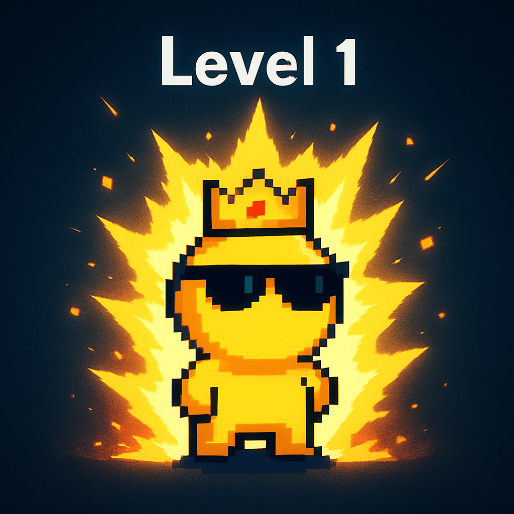
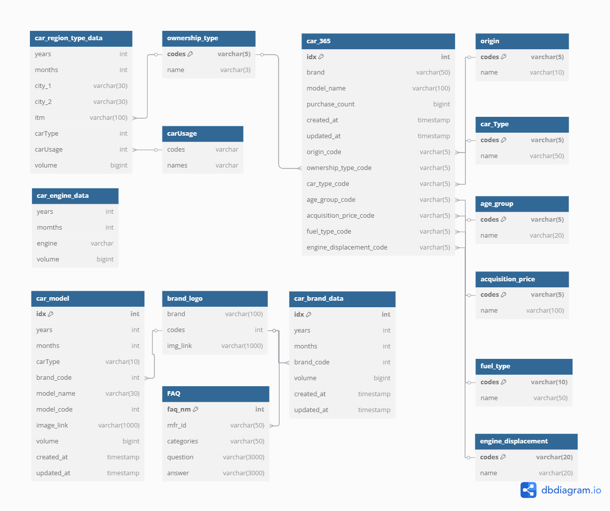
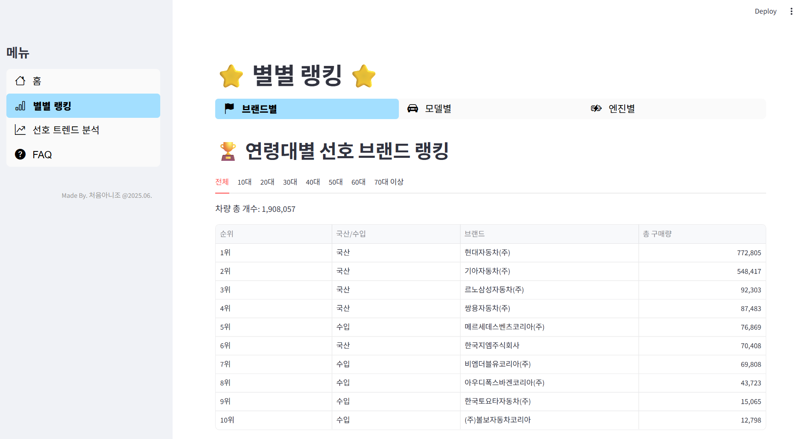
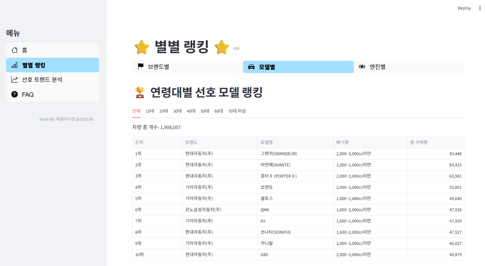
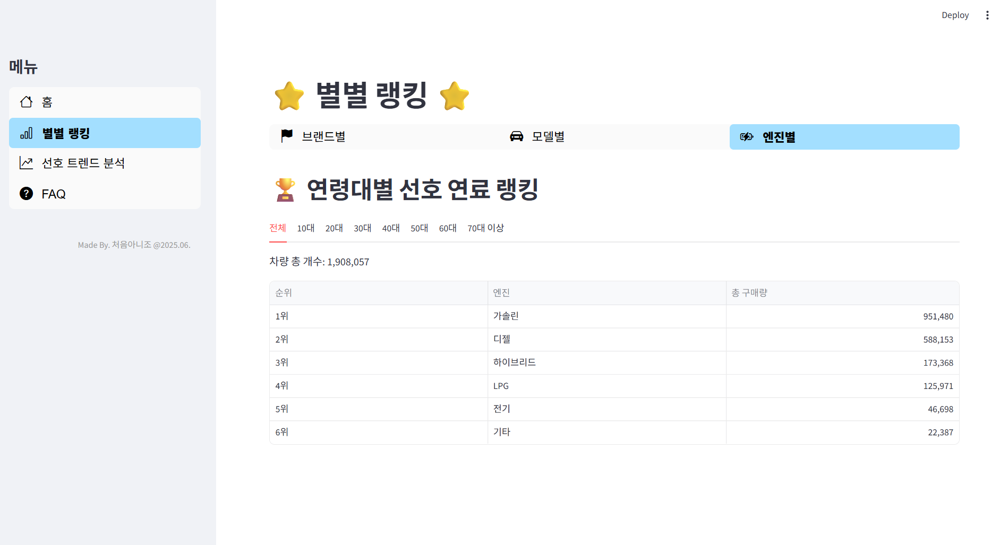

# SKN15-1st-1TEAM

# 1. 팀 소개

  

## 처음아니조

| 기현택 | 김은희 | 서혜선 | 신지혜 | 조태민 |
|:---:|:---:|:---:|:---:|:---:|
| [@mathplanet](https://github.com/mathplanet) | [@eunhiee](https://github.com/euni92) | [@hyeseon](https://github.com/hyeseon7135) | [@jyedu](https://github.com/JYEDU) | [@sunsnu](https://github.com/sunsnu) |

처음아니조는 SKN 15기 1차 과제를 함께하게 된 팀으로,  
비록 이번이 첫 프로젝트이지만 **완성도 높은 결과물**을 통해 처음이 아닌 듯한 실력과 협업력을 보여주고자 합니다.

# 2. 프로젝트 기간

- 2025.06.09 ~ 2025.06.10 (총 2일)

# 3. 프로젝트 개요

## 📕 프로젝트명
- 자동차 선호도 분석 및 기업별 FAQ 제공

## ✅ 프로젝트 배경 및 목적
- 현재 자동차 시장 관련 정보는 전국 등록 현황이나 연령별 선호도 등이 분산되어 있어 사용자가 연령대별 트렌드와 실제 시장 상황을 통합적으로 파악하기 어려움
- 본 프로젝트는 이러한 정보의 파편화로 인한 부족함을 해소하고 사용자들에게 더욱 유익한 정보를 제공하기 위해, 연령대별 자동차 선호 트렌드 데이터와 전국 차량 등록 현황, 그리고 사용자들이 궁금해하는 기업별 FAQ 등의 정보를 한데 모아 분석하고 시각화하여 종합적이고 직관적인 정보를 제공하는 것을 목적으로 함

## 🖐️ 프로젝트 소개
- 자동차의 브랜드, 모델, 연령, 연료, 지역, 월별 등 다양한 요소들을 기반으로 자동차의 현재 트렌드를 분석
- 자동차 기업에서 제공하는 FAQ를 한 눈에 정리하여 볼 수 있도록 서비스를 제공

## ❤️ 기대효과
- 자동차 구매를 고려하는 사용자에게 유용한 정보 제공 및 합리적인 의사결정 지원
- 자동차 산업 관련 기업에게 시장 트렌드 분석 및 마케팅 전략 수립에 필요한 데이터 제공
- 기업별 FAQ 정보를 통해 사용자 편의성 증대

## 👤 대상 사용자
- 자동차 구매를 고려하는 개인
- 자동차 산업 관련 시장 분석가 및 관계자
- 자동차 통계 및 트렌드에 관심 있는 일반 사용자

# 4. 기술 스택

# 5. ERD

  

 

# 6. 수행결과(테스트/시연 페이지)

<h3>홈 화면</h3>

 
<h3>별별 랭킹 화면</h3>

|브랜드별|모델별|엔진별|
|------|---|---|
||||

 
<h3> 화면</h3>

 

# 7. 한 줄 회고

|기현택|김은희|서혜선|
|----|---|---|
|처음 진행하는 프로젝트라 걱정도 많았고 신경이 많이 쓰였는데, 처음부터 회의를 통해 방향을 잡고 점점 진행이 되는 모습을 보면서 프로젝트의 의미에 대해 제대로 느끼고 생각해볼 수 있었습니다. 감사합니다!|혼자 진행했으면 어려웠을 프로젝트지만 팀 동료들이 각자의 역할을 너무 잘 진행해주었기에 즐겁게 프로젝트를 진행할 수 있었던 것 같습니다. 많이 부족했지만 모두들 도와주신 덕분에 프로젝트를 잘 마무리 할 수 있었던 것 같습니다. 다들 고생 많으셨고 감사합니다!|어떻게 시작해야할 지 막막했는데 팀원들과 함께 헤쳐나가니 해낼 수 있었다. 첫번째 프로젝트라 아직은 미숙한 부분이 많았지만 잘 마무리한 것 같아 좋다. 짧지만 진행하면서 많은 것을 배워 한층 성장해가는 것 같았다. 부족한 저를 같이 이끌어 가주셔서 감사합니다! 

|신지혜|조태민|
|----|---|
|2일간의 짧은 프로젝트였기 때문에 목표를 확실히 하고 각 기능을 구현하기 위한 역할분담이 특히 중요했으며, 통일된 구성을 갖춘 시스템을 위해서 지속적으로 소통을 하며 시스템을 구축하였다. 첫 번째 프로젝트였던 만큼 로딩에 있어서 걸리는 시간이나 완벽히 통일된 UI를 구성하진 못했지만 각자의 역할에 최선을 다하며 했기 때문에 후회없다.|처음 진행하는 프로젝트라서 걱정도 많았지만, 감사히도 좋은 팀원들을 만나서 해낼 수 있었습니다! 프로젝트를 준비하면서 서로 사전에 토의하고 단계별로 역할을 분담하면서 함께 해낸다는 경험이 개인적으로 즐거웠습니다. 부족한 부분이 정말 많았지만 팀원들의 덕분에 저의 구멍도 티 안 나게 메꿀 수 있었다고 생각합니다. 덕분에 잘 마무리할 수 있었습니다. 다들 고생 많으셨습니다~|

